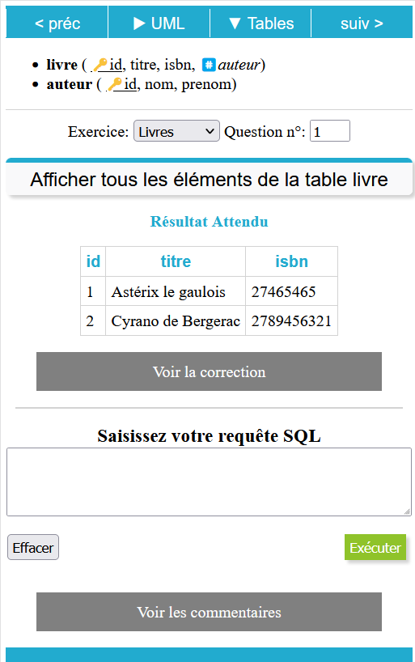
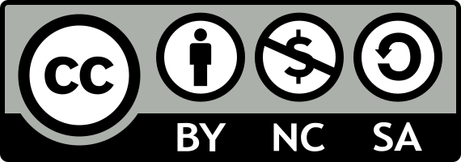

# Réussir le DCG 8
Partage open source des ressources d'entrainement pour les étudiants et les enseignants en systèmes d'informations et gestion: Excel, VBA, SQL, RGPD, Réseau. 

### Objectif
Mettre les exercices des 14 annales à disposition des 5000 étudiants qui s'incrivent chaque année à l'épreuve d'informatique du diplôme de gestion: classeurs excel, base de données, activités, QCM...

Voici les axes du projet. 

## Simplifier l'évaluation par compétences

Le dossier **référentiels** contient le fichier des 622 compétences du DCG prêt à être importé dans moodle. Il est alors possible de lier le succés aux quiz et devoirs à l'acquisition d'une ou plusieurs compétences. 

## Encourager les étudiants à pratiquer

Les fichiers word ou pdf des annales sont transformés en fichiers d'exercice pour faire travailler concrètement les étudiants:

➡️ Réalisation des **fichiers Excel** des 14 annales à partir des captures d'écran fournies dans les sujets, pour que les étudiants puissent tester leurs formules réellement.

➡️ Conversion des **algorithmes en VBA** pour les années 2008 à la réforme de 2019, avec les fichiers de correction.

➡️ Création des **bases de données SQL** pour fournir un outil facilitant l'essai des requêtes par les étudiants et la création de questions complémentaire immédiatement testables pour les enseignants *(les annales 2008 à 2019 sont adaptées pour correspondre à la réforme)*

## Personaliser les rythmes d'apprentissage

Gérer la progression à plusieurs vitesses des étudiants est un défi pour les enseignants. 

➡️ Le dossier [**SQL**](/sql) contient **deux modules interactifs H5P** pour s'initier en autonomie aux bases de cet outil. Ils sont téléchargeables afin d'être intégrés dans une page de cours.

➡️ Le dossier [**excel**](/excel) regroupe une **série de vidéos** sur les 10 points clés du parcours.

➡️ Le dossier [**VBA**](/vba) rassemble une série d'exercices progressifs pour s'entrainer à la programmation.

## Faciliter l'entrainement

Les étudiants ont besoin de répéter régulièrement afin d'acquérir des automatismes, et se rassurer sur leur niveau. 

Les banques de questions correspondant aux annales et aux thèmes sont donc proposées sous trois formats:

* question de **QCM** pour débuter
* question de **texte à trou** pour vérifier la maîtrise (notamment orthographique, cruciale pour cette épreuve écrite)
* questions **rédaction auto-corrigée** : une série d'expression est recherchée automatiqument dans les réponses

## Créer du lien social

Les manuels existants sont encore sur un apprentissage individuel, et n'offrent que très peu d'outils pédagogiques utilisable en cours pour faire travailler les étudiants ensemble.

Le dossier **activités** vise à contenir des activité pour le travail en **binôme** et pour la **pédagogie par projet** en mini groupe.

## Le cours complet

Le projet vise à fournir un modèle de page complet au format moodle, à partir duquel les enseignants pourront composer: compétences, banques de questions, quiz pré-paramétrés pour valider les compétences (généralement après trois tentatives), badges, liens vidéos des replay...

Les nouvelles versions du cours sont mise à disposition chaque mois.

Voir le cours en ligne avant de télécharger: [Cours DCG8](https://www.edu.ep2b.fr/course/view.php?id=7).

## Le site d'entrainement en ligne

Fournir un site en ligne permettant aux étudiants de pratiquer directement leurs requête sur les base des annales:

💎 permettre les requêtes d'ajout, de modification et de suppression

💎 avoir des indices

💎 voir le résultat attendu

💎 voir la ou les corrections possibles

Merci à l'université de Bordeaux (service MAPI) pour l'hébergement du site.

Interface responsive pour permettre l'entrainement sur ordinateur ou sur mobile.

	
# Collaborer au projet

Des millions de développeurs utilisent ce site pour être plus efficaces... pourquoi pas nous les profs? On peut: 

* dupliquer un projet et modifier sa version à volonté
* proposer que certaines modifications soient ajoutées au projet initial
* revenir à une ancienne version d'un document
* avoir des statistiques d'utilisation
* faire remonter des bugs et les corriger

Ce site est totalement collaboratif: [Voir le guide](./xtras/collaborer.md)

# Sponsorisez le projet
Le temps consacré à ce projet est immense et il reste beaucoup à faire. 

Si vous êtes financeurs ou cofinanceur d'initiatives pédagogiques, pensez à apporter votre soutien à ce projet.

En tant que financeurs vous avez besoin de suivre précisément l'évolution du projet: voici les outils mis en place pour garantir l'atteinte des objectifs.

# Licence
La licence actuelle est:

**Creative Commons Attribution-NonCommercial-ShareAlike 4.0 International License**

CC-By-NC-SA

**By**: Vous devez citer la source https://github.com/fxpar/dcg-ue8

**NC**: Vous ne pouvez pas utiliser commercialement ces contenus

**Share-alike**: vous devez distribuez les contenus avec la même licence

 