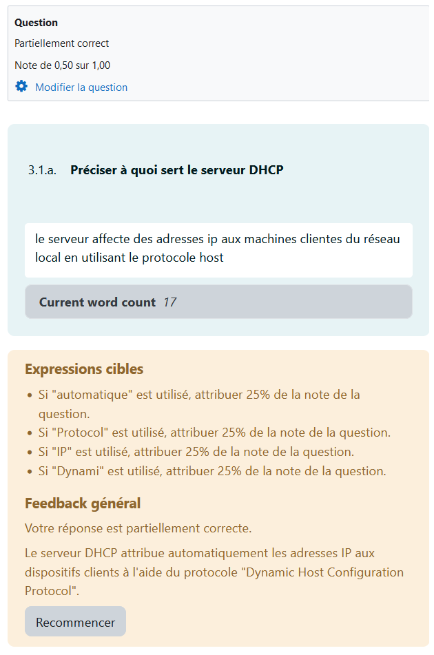

# Activité auto-corrigée pour l'autonomie

## Révisions des définitions
Banque de questions moodle avec autocorrection par nombre d'expression à inclure: [Essay Auto-grade](https://moodle.org/plugins/qtype_essayautograde)

## Création de questions

Utilisation du plugin "Student quiz" de Moodle qui permet aux étudiants de créer leurs propre questions et de s'entrainer dessus, ou de faire s'entrainer le reste de la classe.

