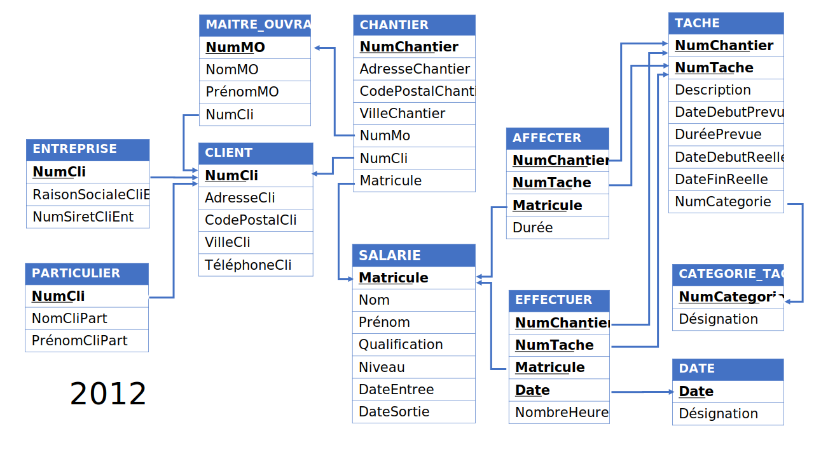

# Annale 2012

## Fichier Excel

La partie Excel de l'annale a été convertie en véritable fichier Excel permettant de tester plusieurs formules.

## VBA

La partie Algorithmie a été transorfmée en véritable VBA afin de servir d'entrainement.

## Schéma simplifié

Pour répondre aux nouvelles attentes de la réforme 2019, le schéma de 2008 a été modifié et adapté.

Les fichiers images (svg et png) et le fichier modifiable (pptx) sont fournis.

## Banque de question

Format: xml moodle

Encodage: UTF8

* 2012 
 * SQL 

Questions de Composition et Choix multiple
