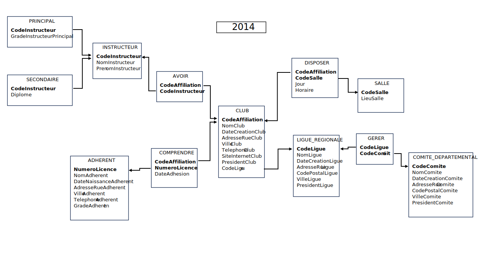

# Annale 2014

## Excel

Version 0.1 du fichier: 

* [x] copie des tables
* [ ] ajout des consignes
* [ ] vérification des données

## Correction VBA
Version étudiant à améliorer et corriger:

	Sub ValeursAides()
		Dim mAideTot As Long
		Dim mAide As Long
		Dim nb As Integer
		Dim rep As String
		rep = MsgBox("Y-at-il une ligne aidée?", vbYesNo)
		Do While rep = vbYes
			mAide = InputBox("Donner le montant de l'aide reçue")
			mAideTot = mAideTot + mAide
			nb = nb + 1
			rep = MsgBox("Y a-t-il une autre ligue aidée?", vbYesNo)
		Loop
		MsgBox ("le montant d'aide total reçu par les lignes est: " & mAideTot & vbCrLf & _
			"Le montant moyen de l'aide reçue par les lignes est: " & mAideTot / nb)
	End Sub

## Schéma simplifié

Pour répondre aux nouvelles attentes de la réforme 2019, le schéma de 2014 a été modifié et adapté.

Les fichiers images (svg et png) et le fichier modifiable (pptx) sont fournis.

