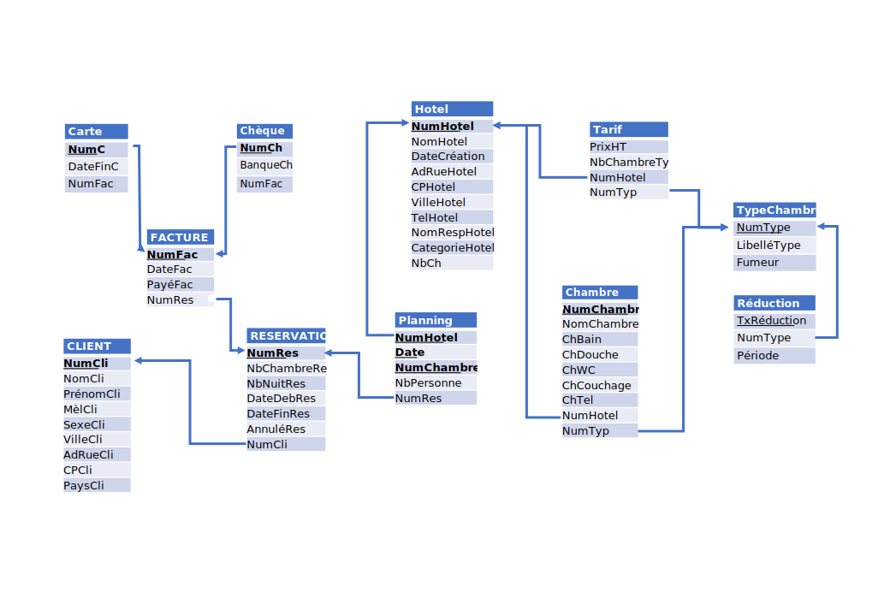

# Annale 2015

## Fichier Excel

La partie Excel de l'annale a été convertie en véritable fichier Excel permettant de tester plusieurs formules.

## VBA

La partie Algorithmie a été transformée en véritable VBA afin de servir d'entrainement.

## Schéma simplifié

Pour répondre aux nouvelles attentes de la réforme 2019, le schéma de 2015 a été modifié et adapté.

Les fichiers images (svg et png) et le fichier modifiable (pptx) sont fournis.

## Base de données

Une première version de la base de données a été créée en version sqlite (basée sur le schéma simplifié).

## Banque de question

Format: xml moodle

Encodage: UTF8

* 2015
 * SQL (7)
 * Réseau et sécurité (2)
 * VBA (1)

Questions de Composition et Choix multiple
