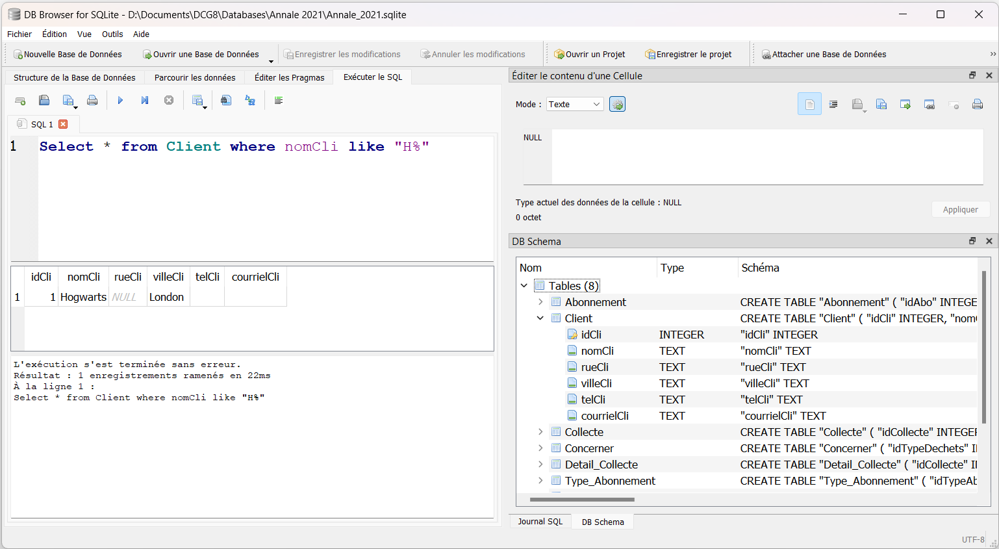

# Annales du DCG 8 Systèmes d'information et de gestion

### VBA
Les algorithmes ont été traduits en VBA.

### SQL

* Les schémas ont été modifiés pour la réforme 2019.
* Les questions sur les cardinalités ont été modifiées ou supprimées
* Certaines bases de données ont été créés pour permettre la création réelle des requêtes (format Access, MySql, SqLite (utilisable facilement avec [SQLite DB Browser](https://sqlitebrowser.org/))

#### Vidéo découverte

La principale différence avec le SQL réside dans les fonctions de date: YEAR, MONTH n'existent pas en Sqlite et on doit utiliser:
* **YEAR(DateFacture):** strftime('%Y', DateFacture) 
* **MONTH(DateFacture):** strftime('%m', DateFacture) 

Le résultat est obligatoirement une chaîne, il faut donc mettre des guillemets autour des années:

	Select * from CHAUFFEURS where strftime("%Y", DateObtention)="2016"

Référence: [sqlite functions de date](https://www.sqlite.org/lang_datefunc.html)

## Progression du projet

* 2022
  * Excel 
    * [x]Sujet
	* [ ] corrigé
  * Base de données
	* [x] Banque de question moodle
    * [ ] Access
	* [ ] Sql
	* [ ] Sqlight
* 2021
  * Excel 
    * [x]Sujet
	* [ ] corrigé
  * Base de données
	* [x] Banque de question moodle
    * [ ] Access
	* [ ] Sql
	* [ ] Sqlight
* 2020
  * Excel 
    * [x]Sujet
	* [ ] corrigé
  * Base de données
    * [ ] Schéma réformé
	* [x] Banque de question moodle
    * [ ] Access
	* [ ] Sql
	* [ ] Sqlight
* 2019
  * Excel 
    * [x]Sujet
	* [ ] corrigé
  * Base de données
    * [ ] Schéma réformé
	* [x] Banque de question moodle
    * [ ] Access
	* [ ] Sql
	* [ ] Sqlight
  

