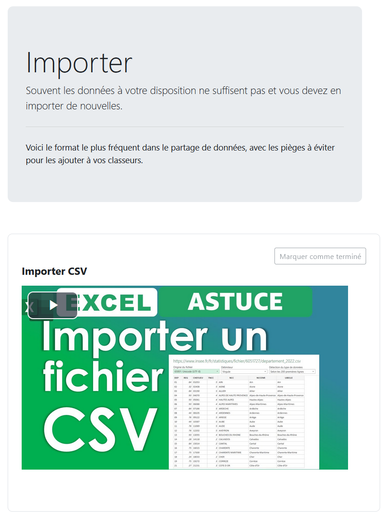

# Le cours complet DCG UE8 à télécharger

Vous trouverez ici une sauvegarde Moodle du cours complet de système d'information et de gestion, prête à être installée.

## navigation

Le menu de navigation permet d'aller directement à la section recherchée.

# Le référentiel de Compétences

Parmi les 622 compétences du DCG les 70 concernant l'informatique ont été rattachée au cours avec leurs savoirs associés.

## Ressources et activités

Chaque partie dispose de ses introductions et de ses replays en vidéo:

## annales 

(bases de données, fichiers excel...)

# En cours d'ajout
(objectif version 1.0)

*Ressources et activités
  * vidéo interactive H5P (à importer)
  * exercices en solo, en binômes, en mini-groupes
* Quiz d'entrainement
  * paramétrés pour valider les compétences après 3 succès avec une note à atteindre croissante
* Badges
* Feedbacks
  * début de parcours
  * début et fin de séance
  * fin de parcours
* Banque de questions
  * questions d'initiation (QCM simples)
  * questions de maîtrise (Texte à trous)
  * questions de compréhension (composition auto notée)
  
# Pages plus comlètes

Il existe des [contenus plus riches](https://github.com/fxpar/Cours) en vidéo, en cours de publication également sur Github : cours Excel ([voir la démo](https://www.edu.ep2b.fr/course/view.php?id=6)), cours VBA, cours Access, cours PowerBi.