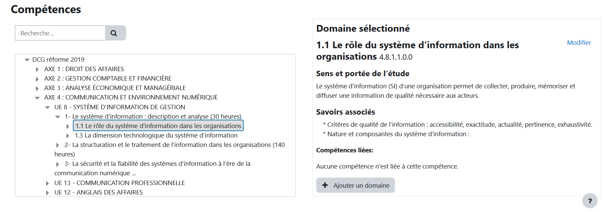

# Référentiels DCG UE8

La recopie et la codification des 622 compétences du bulletin officiel a constitué un énorme travail. On espére que les ministères proposeront à l'avenir une version informatisée du contenus des enseignements.

Le fichier complet est importable dans moodle via la page https://VOTRE-SITE-MOODLE/admin/tool/lpimportcsv/index.php

## Vue du référentiel dans Moodle

## Autres documents

* Bulletin officiel
* Bulletin officiel numérisé modifiable
* Compétences moodle à importer

## Progression

* [x] Recopie des 622 compétences et des savoirs associés
* [x] Codification des compétences
* [x] Création du référentiel de compétences à importer dans Moodle
* [ ] Modifier l'échelle du référentiel de compétence
* [ ] Vérifier la visibilité des puces dans Moodle 4

