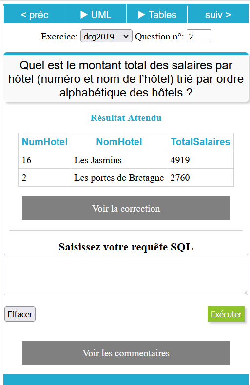

# Maîtriser les requêtes SQL
Les outils interactifs pour découvrir et pratiquer

## Découverte SQL
À quoi servent les différentes requêtes: sélectionner, ajouter, modifier, supprimer

### Vidéo interactive

### Vidéo seule

La vidéo simple sur YouTube[:

Découverte sql](https://www.youtube.com/watch?v=HpI_tety6XU)

## SQL Mutli Tables

Pratiquer les relations entre les tables (jointures) pour vraiment maîtriser le SQL

### Vidéo interactive

### Vidéo Seule
[SQL multi tables](https://www.youtube.com/watch?v=Wdd_K9t7ZwI)

## Access

### Créer sa première base de données
Découverte des tables, des relations, des formulaires, des états, des macros.

### Créer une requête de mise à jour

# SQLpratique

**Site d'entrainement en ligne**:

Les bases de données SQL sont progressivement mise en ligne pour permettre l'entrainement aux requêtes:

* de sélection
* de suppression
* d'ajout

Travailler en mobilité:
* vue responsive pour entrainement sur smartphone comme sur ordinateur

Annales disponibles:
* 2022
* 2020
* 2019

 
* identifiant: externe
* mot de passe: externe

## Visuel v.1.0

Merci à l'université de Bordeaux (service MAPI) pour l'hébergement du site.

## Code source SQLpratique

Le code source du projet est hébergé également sur Github: [SQLpratique](https://github.com/fxpar/SQLpratique)

