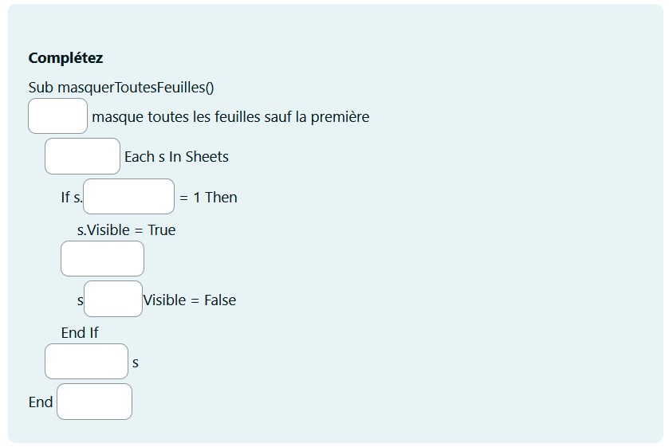

# VBA pour le DCG
Les ressources pour enseigner et réussir l'épreuve de programmation VBA pour Excel.

* **Banque de question**
  * QCM
  * Texte à trous
* **Exercices pour la gestion**
  * Cellules
  * Feuilles
  * Système de fichier
* **Tutos vidéo**
  * fondamentaux du VBA
  * les boucles
  * exemples corrigés
  
## Que contient la banque de question?

Seuls les types de questions standard de moodle sont utilisées (aucun ajout de plugin nécéssaire).

### Des cloze à choix multiples

Ces questions permettent de poser plusieurs questions en une seule. Idéal pour vérifier plusieurs point liés par une même thématique, ou pour tester la cohérence d'un raisonnement en plusieurs points ou la logique d'une démarche.

### Des QCM classiques

Pour accompagner progressivement l'acquisition des connaissances.

### Des cloze à trou

Ces questions n'ayant pas de proposition, l'étudiant doit maîtriser parfaitement la réponse et son orthographe. Niveau avancé.

La correction apparaît en passant la souris au dessus des trous.

  
## Annales contenant du VBA

* [2016](./../annales/2016)

## Tuto Vidéos

### les boucles (Youtube)
[Boucles en vba](https://www.youtube.com/watch?v=L8WpmcXGkMg)

### Exercices simples corrigés

#### Enoncé

#### Corrigé

### VBA dans LibreOffice
Vous pouvez faire pratiquer le VBA à vos étudiants même si votre institution ne fournit pas de licence Microsoft. Voici le tuto pour LibreOffice Calc:

