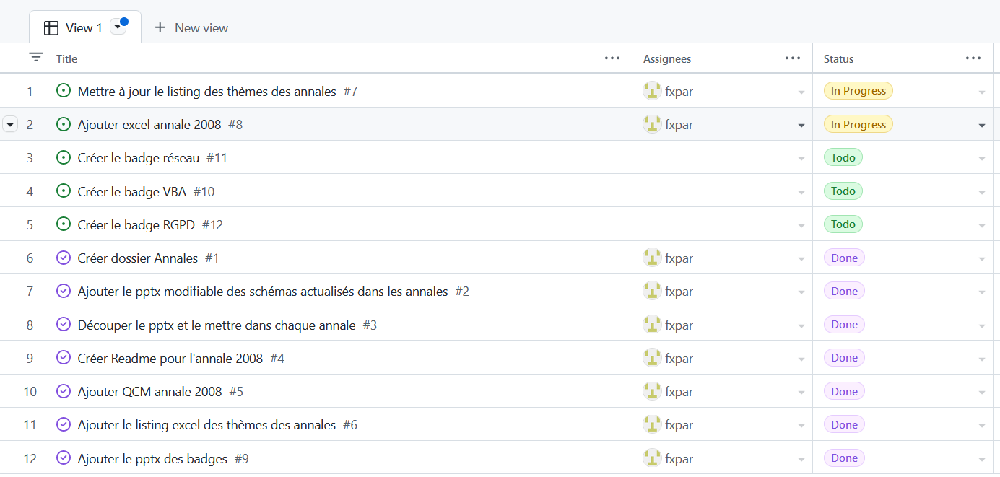
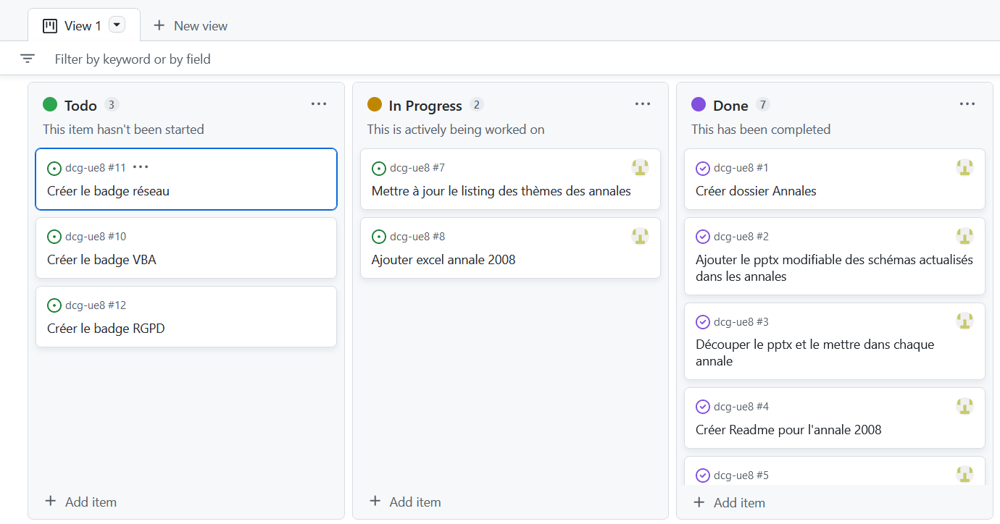

# Collaborer au projet

Ce projet open source est hébergé sur Github pour facilité toutes les collaborations, des plus simples au plus geeks.

## Partager les ressources 
Les ressources sont publiées en licence Creative Commons CC-NC-By-Sa, ce qui signifie que vous pouvez les partager tant que vous ne faites rien payer, que vous ne modifiez pas la licence, et que vous citez la source: https://github.com/fxpar/dcg-ue8/

### Auprès de vos collègues
N'hésitez pas à recommander ce projet et les ressources si elles vous paraissent utiles

### Auprès des étudiants
Un projet pédagogique s'enrichit des expériences de chacun. Remontez dans la partie "discussion" la façon dont vous avez utilisé les ressources avec vos étudiants et les résultats obtenus.

## Mettez une étoile
⭐ Si vous vous décidez à créer un compte github, commencez par mettre un étoile à ce projet, vous n'imaginez pas à quel point cela fait plaisir.

👁️‍🗨️ Vous pouvez aussi mettre une oeil pour "suivre" le projet.

## Ajouter des demandes et signaler des bugs

Vous pouvez très simplement poster des nouvelles demandes afin d'aider à prioriser les actions.
1. Créez votre compte
2. Venez sur ce projet
3. Cliquez sur "Issues" en haut

N'hésitez pas à ajouter des tags comme Annales, Excel, VBA...

Vous pourrez suivre l'évolution de votre demande et vous serez avertit des changements la concernant.


## Ajouter et modifier des ressources

Github est un outil génial de synchronisation entre plusieurs versions d'un projet. Il permet de fusionner les ressources.


1. Créez un compte (c'est entièrement gratuit)
1. "Fourchez" le projet ("fork"): cela crée une copie du projet dans votre espace
1. Modifier ou ajouter les contenus dans votre espace
1. Demandez l'ajout de vos modifications dans le projet original (pull request)
    * l'outil vous dira si vos modifications peuvent être intégrées au projet ou si celui-ci à évolué entre temps
    * il vaut donc mieux faire régulièrement des propositions d'intégration pour éviter les conflits
1. Devenez éditeur du projet initial pour pouvoir valider les ajouts des autres

````mermaid
%%{init: { 'logLevel': 'debug', 'theme': 'base', 'gitGraph': {'showBranches': true, 'showCommitLabel':true,'mainBranchName': 'VersionOriginale'}} }%%
gitGraph
    commit id: "1"
    commit id: "2"
    branch VotreVersion
    checkout VotreVersion
    commit id: "Ajout"
    checkout VersionOriginale
    commit id: "3"
    checkout VotreVersion
    commit id: "Modifs"
    checkout VersionOriginale
    merge VotreVersion id: "4"  tag: "intégration"
    commit id: "5"
    commit id: "6"
````

## Les autres outils

Github inclut tous les outils de la collaboration:

* forum pour discuter le projet
* remontée des bugs et des demandes
* suivi des statistiques: fourchage du projet, ajouts...

# Et pourquoi pas financer le projet
Un tel projet demande un temps incroyable... si les ressources font gagner du temps à votre institutions, pensez à devenir sponsors de cette initiative.

### Vue en table


### Vue en plateau



