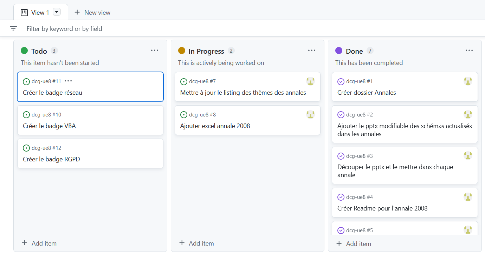

# Collaborer sur Github

Github est un outil génial de synchronisation entre plusieurs versions d'un projet. Il permet de fusionner les ressources.


1. Créez un compte (c'est entièrement gratuit)
1. "Fourchez" le projet ("fork"): cela crée une copie du projet dans votre espace
1. Modifier ou ajouter les contenus dans votre espace
1. Demandez l'ajout de vos modifications dans le projet original (pull request)
    * l'outil vous dira si vos modifications peuvent être intégrées au projet ou si celui-ci à évolué entre temps
    * il vaut donc mieux faire régulièrement des propositions d'intégration pour éviter les conflits
1. Devenez éditeur du projet initial pour pouvoir valider les ajouts des autres

````mermaid
gitGraph
    commit
    commit
    branch VotreVersion
    checkout develop
    commit id: "ajout"
    commit id: "modif"
    checkout main
    merge develop
    commit
    commit
````

## Les autres outils

Github inclut tous les outils de la collaboration:

* forum pour discuter le projet
* remontée des bugs et des demandes
* suivi des statistiques: fourchage du projet, ajouts...

### Vue en table


### Vue en plateau


## Téléchargez le projet sur votre machine

Github permet également de gérer la synchronisation des fichiers de votre projet en ligne / votre projet sur votre machine.

## Aller plus loin

* [Comprendre Github](https://www.hostinger.fr/tutoriels/github-cest-quoi-et-comment-lutiliser)

