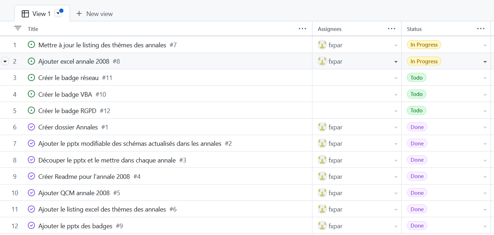

# Pour les sponsors

Si ces ressources aident vos équipes, et que vous adhérez aux valeurs de partage de la licence Creative Common, n'hésitez pas à devenir sponsor de cette initiative.

Voici les outils de gestion et de suivi mis en place pour vous permettre de suivre en temps réel la progression du projet.

## Des objectifs clairs

Les développeurs ont énormément fait évoluer la démarche qualité:
* les objectifs prioritaires ont été entrés dans la liste des issues
* les milestones (jalons) ont été fixées
* les itérations ont une durée de 2 semaines

### Vue en table

### Vue en plateau

